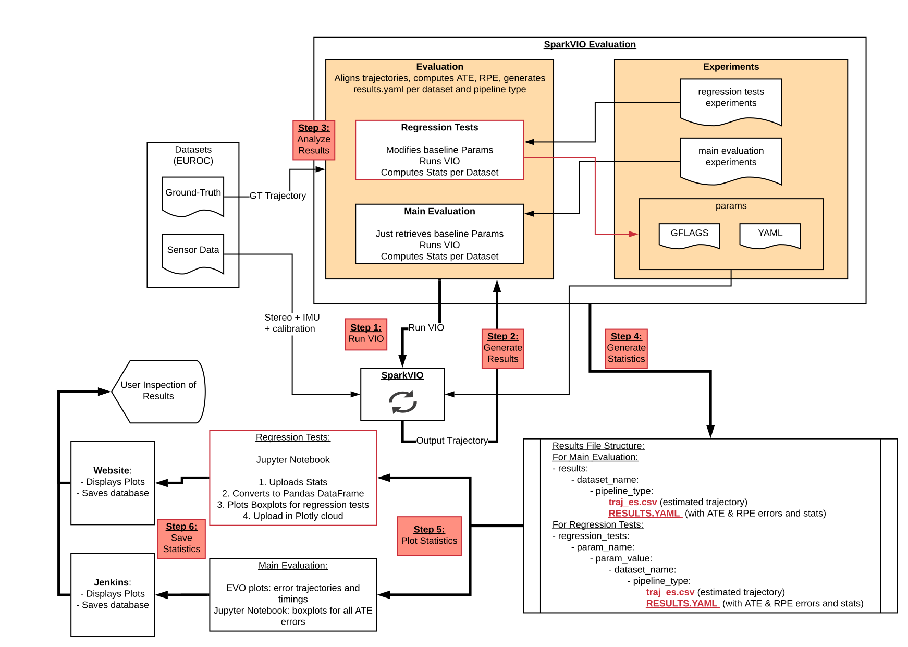

# Kimera VIO Evaluation


Code to evaluate and tune [Kimera-VIO](https://github.com/MIT-SPARK/Kimera-VIO) pipeline on [Euroc's dataset](https://projects.asl.ethz.ch/datasets/doku.php?id=kmavvisualinertialdatasets).

This repository contains two main scripts:
- `main_evaluation.py`: given an experiment yaml file with specifications (see `experiments` folder), it runs Kimera-VIO pipeline to generate an estimated trajectory.
Then, it aligns ground-truth trajectory with estimated trajectory, and computes error metrics (Absolute Translation Error (ATE), Relative Pose Error (RPE)).
It also displays or saves plots about its performance. All functionality is optional (check parameters below).

**[OUTDATED]**
- `regression_tests.py`: runs Kimera-VIO with different parameters as specified in an experiment yaml file. It displays Absolute Translation Error (ATE) boxplots for each parameter setting to allow visual inspection of what set of parameters is performing well. Check parameters below for functionality.

# Prerequisites

- numpy
- pyyaml
- evo-1 // Fork from [evo](https://github.com/MichaelGrupp/evo)
- open3d-python
- plotly

> We strongly recommend setting a new virtual environment to avoid conflicts with system-wide installations:
> ```bash
> sudo apt-get install virtualenv
> virtualenv -p python2.7 ./venv
> source ./venv/bin/activate
> ```

# Installation
```bash
git clone https://github.com/ToniRV/Kimera-VIO-Evaluation
cd Kimera-VIO-Evaluation
pip install .
python setup.py develop
```

# Example Usage

## Main Evaluation

The script `main_evaluation.py` runs and evaluates the VIO performance by aligning estimated and ground-truth trajectories and computing error metrics.
It then saves plots showing its performance.

The script expects an **experiment** yaml file with the following syntax:
```yaml
executable_path: '$HOME/Code/spark_vio/build/stereoVIOEuroc'
results_dir: '$HOME/Code/spark_vio_evaluation/results'
params_dir: '$HOME/Code/spark_vio_evaluation/experiments/params'
dataset_dir: '$HOME/datasets/euroc'

datasets_to_run:
 - name: V1_01_easy
   segments: [1, 5]
   pipelines: ['S']
   discard_n_start_poses: 10
   discard_n_end_poses: 10
   initial_frame: 100
   final_frame: 2100
 - name: MH_01_easy
   segments: [5, 10]
   pipelines: ['S', 'SP', 'SPR']
   discard_n_start_poses: 0
   discard_n_end_poses: 10
   initial_frame: 100
   final_frame: 2500

```

The experiment yaml file specifies the following:
- `executable_path`: where to find the built binary executable to run Kimera-VIO.
- `results_dir`: the directory where to store the results for each dataset. This directory is already inside this repository.
- `params_dir`: the directory where to find the parameters to be used by Kimera-VIO.
- `dataset_dir`: the path to the Euroc dataset.
- `datasets_to_run`: specifies which Euroc datasets to run, with the following params:
  - `name`: the name of the Euroc dataset to run. It must match exactly to the subfolders in your path to Euroc dataset.
  - `segments`: these are the distances btw poses to use when computing the Relative Pose Error (RPE) metric. If multiple are given, then RPE will be calculated for each given distance. For example, if `segments: [1, 5]`, RPE will be calculated for all 1 meter apart poses and plotted in a boxplot, same for all 5m apart poses, etc.
  - `pipelines`: this can only be `S`, `SP`, and/or `SPR`; the vanilla VIO corresponds to `S` (structureless factors only). If using the RegularVIO pipeline [1] then `SP` corresponds to using Structureless and Projection factors, while `SPR` makes use of Regularity factors as well.
  - `discard_n_X_poses`: discards `n` poses when aligning ground-truth and estimated trajectories.
  - `initial/final_frame`: runs the VIO starting on `initial_frame` and finishing on `final_frame`. This is useful for datasets which start/finish by bumping against the ground, which might negatively affect IMU readings.

`./evaluation/main_evaluation.py -r -a --save_plots --save_results --save_boxplots experiments/example_euroc.yaml`

where, as explained below, the `-r` and `-a` flags run the VIO pipeline given in the `executable_path` and analyze its output.


**[OUTDATED]**
## Regression Tests

The `regression_tests.py` script is in essence very similar to the `main_evaluation.py` script: it runs the VIO pipeline, computes error metrics, and displays results.
The only difference is that its **experiment** yaml file expects two extra fields:
- `regression_tests_dir`: the path where to store the tests results. This repo already provides a `regression_tests` folder for convenience.
- `regression_parameters`: which specifies the VIO parameters to modify on each run.

For example, below we expect the VIO pipeline to run by modifying each time the `smartNoiseSigma` parameter, while reporting results in

```yaml
# Here goes the same as in a main_evaluation experiment file [...]
# This is the path where to store the regression tests.
regression_tests_dir: '$HOME/Code/spark_vio_evaluation/regression_tests'
# Here goes the datasets_to_run
# This is the list of parameters to regress, and the values to test.
regression_parameters:
  - name: 'smartNoiseSigma'
    values: [1.0, 1.2, 1.4, 1.6, 1.8, 2.0, 2.2, 2.4, 2.6, 2.8, 3.0, 3.2, 3.4]
```

Check the `experiments` folder for an example of a complete `regression_test.yaml` experiment file.

Once the regression tests have finished running, you can visualize the results using the `plot_regression_tests.ipynb` jupyter notebook.
The notebook will mainly pull the results from the root of the regression test results, save all statistics in a file `all_stats.yaml` and plot results.
> Note that the notebook will reload the `all_stats.yaml` if it finds one instead of repulling all statistics from the results directory.
> If you want the regression tests to query again the results dir, then remove the `all_stats.yaml` file at the root of results dir.

# Usage

Run `./evaluation/main_evaluation.py --help` to get usage information.

```bash
usage: main_evaluation.py [-h] [-r] [-a] [--plot]
                          [--plot_colormap_max PLOT_COLORMAP_MAX]
                          [--plot_colormap_min PLOT_COLORMAP_MIN]
                          [--plot_colormap_max_percentile PLOT_COLORMAP_MAX_PERCENTILE]
                          [--save_plots] [--save_boxplots] [--save_results]
                          experiments_path

Full evaluation of SPARK VIO pipeline (APE trans + RPE trans + RPE rot) metric
app

optional arguments:
  -h, --help            show this help message and exit

input options:
  experiments_path      Path to the yaml file with experiments settings.

algorithm options:
  -r, --run_pipeline    Run vio?
  -a, --analyse_vio     Analyse vio, compute APE and RPE

output options:
  --plot                show plot window
  --plot_colormap_max PLOT_COLORMAP_MAX
                        The upper bound used for the color map plot (default:
                        maximum error value)
  --plot_colormap_min PLOT_COLORMAP_MIN
                        The lower bound used for the color map plot (default:
                        minimum error value)
  --plot_colormap_max_percentile PLOT_COLORMAP_MAX_PERCENTILE
                        Percentile of the error distribution to be used as the
                        upper bound of the color map plot (in %, overrides
                        --plot_colormap_min)
  --save_plots          Save plots?
  --save_boxplots       Save boxplots?
  --save_results        Save results?
  -v, --verbose_sparkvio
                        Make Kimera-VIO log all verbosity to console. Useful
                        for debugging if a run failed.
```


Run `./evaluation/regression_tests.py --help` to get usage information.
```bash
usage: regression_tests.py [-h] [-r] [-a] [--plot] [--save_plots]
                           [--save_boxplots] [--save_results]
                           experiments_path

Regression tests of SPARK VIO pipeline.

optional arguments:
  -h, --help          show this help message and exit

input options:
  experiments_path    Path to the yaml file with experiments settings.

algorithm options:
  -r, --run_pipeline  Run vio?
  -a, --analyse_vio   Analyse vio, compute APE and RPE

output options:
  --plot              show plot window
  --save_plots        Save plots?
  --save_boxplots     Save boxplots?
  --save_results      Save results?
```

# Jupyter Notebooks

Provided are jupyter notebooks for extra plotting.

# Chart of implementation details:



# Notes

The behaviour for the plots depends also on `evo_config`.
For example, in Jenkins we use the default `evo_config` which does not split plots.
Yet, locally, you can use `evo_config` to allow plotting plots separately for adding them in your paper.

# References
[1] A. Rosinol, T. Sattler, M. Pollefeys, and L. Carlone. **Incremental Visual-Inertial 3D Mesh Generation with Structural Regularities**. IEEE Int. Conf. on Robotics and Automation (ICRA), 2019.
[2] A. Rosinol, M. Abate, Y. Chang, L. Carlone, [**Kimera: an Open-Source Library for Real-Time Metric-Semantic Localization and Mapping**](https://arxiv.org/abs/1910.02490). IEEE Intl. Conf. on Robotics and Automation (ICRA), 2020. [arXiv:1910.02490](https://arxiv.org/abs/1910.02490).
